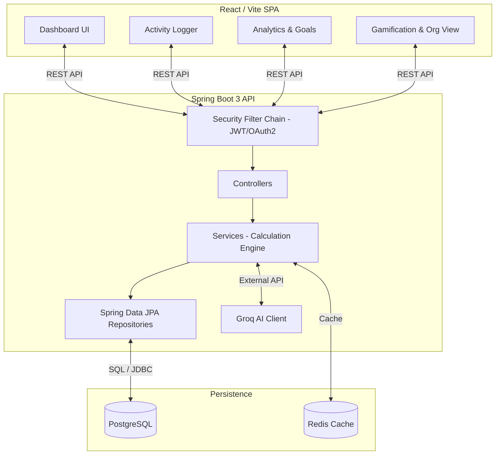

# CarbonTrack System Architecture

## Overview
CarbonTrack is a full-stack sustainability platform designed with a modern Spring Boot 3 backend and a React (Vite) frontend.

## Architecture Diagram

## Deployment Stack
- **Frontend**: Containerized React app served by Nginx.
- **Backend**: Containerized Spring Boot 3 Java 21 application.
- **Database**: PostgreSQL 15 running in Docker with persistent volumes.
- **Cache**: Redis 7 running in Docker.

## CI/CD Readiness
- **Testing**: Includes JUnit 5 suites and `k6` load testing scripts.
- **Documentation**: Springdoc OpenAPI / Swagger automatically exposed at `/swagger-ui/index.html`.
- **Containers**: Includes `docker-compose.yml` for unified, single-command deployment.
